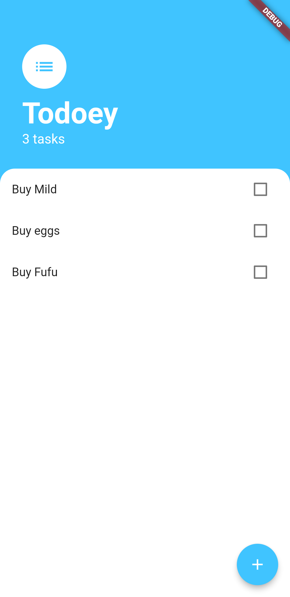
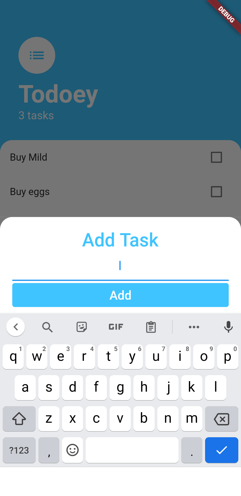

# todo

A Flutter Simple todo list app

## Getting Started

This is a simple to-do list application made in flutter that handles major concepts. These 
concepts include; State Management(the use of the provider package, lifting up state).
You can add items to the list, check the up by clicking the checkbox and delete items using
a long tap.

## Dependencies
- provider: ^6.0.1

Project Sample:
 

